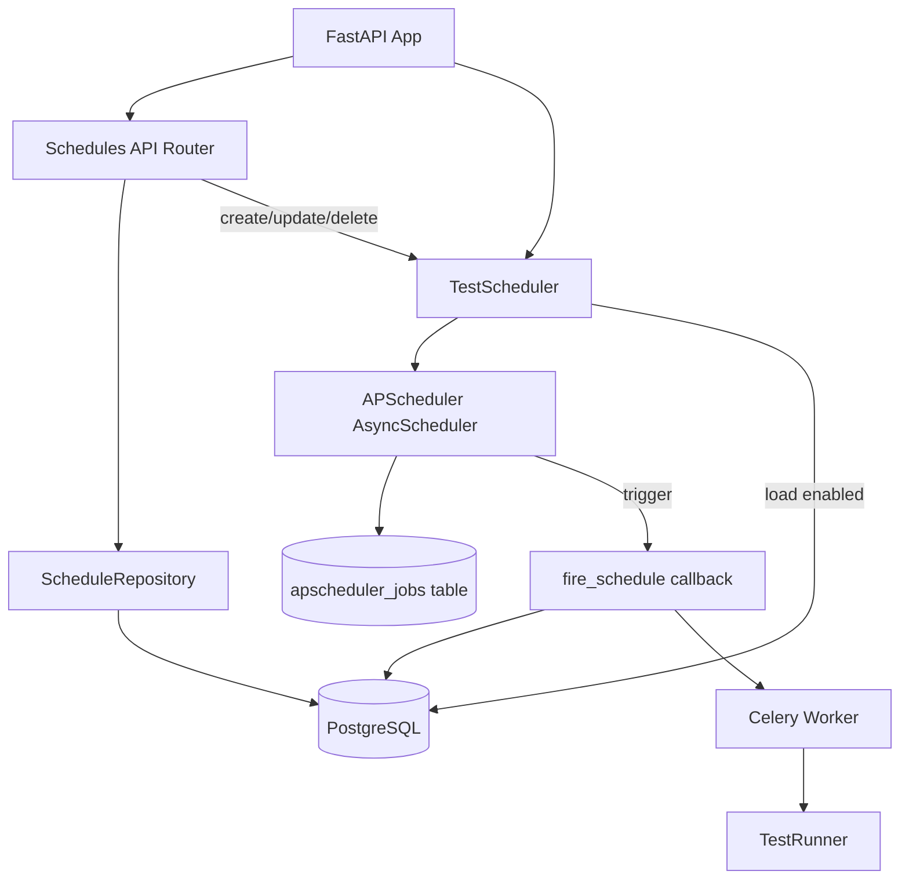

## 需求概述

基于 APScheduler 实现测试执行调度引擎，支持 Cron 定时、Interval 间隔、手动触发三种方式，调度状态持久化到数据库，触发时通过 Celery Task 异步执行测试用例。

## 产品概述

在现有 API 测试框架基础上，新增调度管理功能。用户可通过 API 创建定时任务，关联测试套件和环境，到达指定时间后自动触发 Celery 异步执行。调度配置持久化到数据库，支持查看调度列表和删除调度。

## 核心功能

- **调度配置管理**：通过 API 创建、查看、更新、删除调度任务（CRUD）
- **Cron 定时触发**：支持标准 cron 表达式配置定时执行
- **Interval 间隔触发**：支持按固定间隔周期执行
- **手动触发**：通过 API 手动触发调度执行
- **调度状态持久化**：调度配置和 APScheduler 作业状态均持久化到 PostgreSQL
- **自动执行**：调度触发时自动创建执行记录并调用 Celery Task

## 技术栈选择

- **调度引擎**：APScheduler 3.10+（AsyncScheduler，适配项目异步架构）
- **作业持久化**：SQLAlchemyJobStore（与项目 ORM 一致，持久化到 PostgreSQL）
- **任务执行**：Celery Task（`worker.tasks.run_execution_task`），依赖已完成的 T3-1 Worker
- **API 框架**：FastAPI（沿用项目现有框架）
- **数据验证**：Pydantic v2（沿用项目现有模式）
- **数据库 ORM**：SQLAlchemy 2.0 异步（沿用项目现有模式）
- **日志**：structlog（沿用 `Logger.get("module_name")` 模式）
- **配置管理**：ConfigLoader 单例（沿用项目现有模式）

## 实现方案

### 总体策略

采用分层架构，将 APScheduler 封装在 `framework/scheduler.py` 中，通过 Repository 模式访问调度配置，通过 FastAPI Router 提供 REST API。调度触发时，回调函数在独立异步上下文中创建执行记录并发送 Celery Task。

### 核心设计决策

1. **ScheduleModel + SQLAlchemyJobStore 双表策略**

- `schedules` 表：用户面向的调度配置（名称、套件、环境、触发类型、启用状态等）
- `apscheduler_jobs` 表：APScheduler 自动管理的作业状态表（SQLAlchemyJobStore 自动维护）
- 两者通过 `schedule_id`（字符串形式）关联：APScheduler Job ID = ScheduleModel.id 的字符串表示
- **理由**：`schedules` 表提供用户友好的配置管理；`apscheduler_jobs` 表由 APScheduler 自动维护，确保作业状态一致性。双表职责清晰，避免重复造轮子。

2. **APScheduler AsyncScheduler**

- 使用 `AsyncIOScheduler` 适配项目异步架构
- 事件循环与 FastAPI 共享，避免额外线程
- **理由**：项目大量使用 `async/await`，AsyncScheduler 天然适配，避免线程间同步问题。

3. **调度触发回调设计**

- 定义模块级异步函数 `fire_schedule(schedule_id: str)` 作为 APScheduler 作业回调函数
- 回调内：创建独立 AsyncSession → 读取 ScheduleModel → 创建 ExecutionModel → 查询套件用例 ID → 发送 Celery Task → 更新 last_run_at
- **理由**：模块级函数可 pickle（APScheduler 内部可能需要），通过 `async_session_factory` 创建独立会话，不依赖 HTTP 请求上下文。

4. **应用生命周期集成**

- 在 `api/main.py` 中使用 FastAPI lifespan 事件管理调度器启停
- 启动时：初始化 APScheduler → 从 `schedules` 表加载所有 enabled=True 的调度 → 添加到 APScheduler
- 关闭时：调用 `scheduler.shutdown()`
- **理由**：确保调度器与 FastAPI 应用生命周期一致，避免孤儿作业。

### 性能与可靠性考量

- **瓶颈**：调度触发时的 DB 查询和 Celery Task 发送为 I/O 操作，使用异步避免阻塞
- **容错**：回调函数内捕获所有异常，记录日志但不影响其他调度执行
- **幂等性**：ExecutionModel 创建使用独立事务，Celery Task 幂等（通过 exec_id 去重）
- **SQLAlchemyJobStore**：APScheduler 内置支持，自动处理作业序列化/反序列化，无需手动管理

## 实现说明

### 性能考量

- 调度触发为低频次操作（秒级/分钟级），性能瓶颈不在调度器本身
- 回调中的 DB 操作使用独立会话，不阻塞 FastAPI 请求处理
- Celery Task 发送为异步非阻塞操作（`delay()` 立即返回）

### 日志规范

- 使用 `Logger.get("framework.scheduler")` 和 `Logger.get("api.routers.schedules")`
- 关键操作（创建/删除调度、触发执行）记录结构化日志
- 回调中的异常记录到 structlog，不影响 APScheduler 主循环

### 影响面控制

- 新增文件不影响现有功能
- `api/main.py` 修改仅新增调度器初始化逻辑，保留现有路由注册
- 数据库迁移为新增表，不修改现有表结构
- 回滚：若调度功能异常，可通过 `enabled=False` 禁用所有调度，或直接回滚迁移

## 架构设计

### 系统架构



### 数据流

1. **创建调度**：API → ScheduleRepository → DB + TestScheduler.add_job() → APScheduler → apscheduler_jobs 表
2. **调度触发**：APScheduler → fire_schedule(schedule_id) → DB 查询 → 创建 ExecutionModel → Celery Task → Worker 执行
3. **删除调度**：API → TestScheduler.remove_job() → APScheduler → apscheduler_jobs 表 + ScheduleRepository.delete() → DB

### 模块划分

- **持久化层**：ScheduleModel（ORM）、ScheduleRepository（数据访问）
- **调度引擎层**：TestScheduler（APScheduler 封装）、fire_schedule（触发回调）
- **API 层**：schedules.py Router（HTTP 端点）、Pydantic Schemas（请求/响应验证）

## 目录结构

### 目录结构说明

本实现新增调度引擎功能，包括持久化模型、数据访问层、调度引擎封装、API 路由和数据库迁移。所有新增文件遵循项目现有分层架构和命名规范。

```
api-test-framework/
├── framework/
│   ├── persistence/
│   │   ├── models/
│   │   │   ├── schedule.py          # [NEW] ScheduleModel ORM 模型定义
│   │   │   └── __init__.py          # [MODIFY] 新增 ScheduleModel 导出
│   │   └── repositories/
│   │       ├── schedule_repo.py     # [NEW] ScheduleRepository 数据访问层
│   │       └── __init__.py          # [MODIFY] 新增 ScheduleRepository 导出
│   └── scheduler.py                 # [NEW] TestScheduler 封装（APScheduler AsyncScheduler 封装，提供 start/stop/add/remove/list 方法，管理调度生命周期）
├── api/
│   ├── routers/
│   │   ├── schedules.py            # [NEW] 调度管理 API Router（POST/GET/PUT/DELETE /api/v1/schedules，POST /api/v1/schedules/{id}/run 手动触发）
│   │   └── __init__.py             # [MODIFY] 新增 schedules router 导出
│   ├── schemas/
│   │   └── schedule.py             # [NEW] 调度 Pydantic Schema（ScheduleCreate/ScheduleUpdate/ScheduleResponse/Pagination 响应）
│   └── main.py                     # [MODIFY] 注册 schedules router，添加 FastAPI lifespan 事件初始化/关闭调度器
├── alembic/versions/
│   └── 20250606_add_schedules.py   # [NEW] Alembic 迁移脚本（创建 schedules 表）
└── requirements.txt                 # [MODIFY] 新增 apscheduler>=3.10.0 依赖
```

## 关键代码结构

### ScheduleModel ORM 模型

```python
class ScheduleModel(Base):
    __tablename__ = "schedules"

    id: Mapped[uuid.UUID] = mapped_column(
        UUID(as_uuid=True), primary_key=True, default=uuid.uuid4,
        comment="主键 UUID"
    )
    name: Mapped[str] = mapped_column(
        String(100), nullable=False,
        comment="调度名称"
    )
    suite_id: Mapped[uuid.UUID] = mapped_column(
        UUID(as_uuid=True),
        ForeignKey("test_suites.id", ondelete="CASCADE"),
        nullable=False,
        comment="关联测试套件 ID"
    )
    env_name: Mapped[str] = mapped_column(
        String(50), nullable=False,
        comment="执行环境名称"
    )
    trigger_type: Mapped[str] = mapped_column(
        String(20), nullable=False,
        comment="触发类型: cron/interval/manual"
    )
    cron_expression: Mapped[str | None] = mapped_column(
        String(100), nullable=True,
        comment="Cron 表达式 (分 时 日 月 周)"
    )
    interval_seconds: Mapped[int | None] = mapped_column(
        Integer, nullable=True,
        comment="间隔秒数 (仅 trigger_type=interval)"
    )
    enabled: Mapped[bool] = mapped_column(
        Boolean, default=True,
        comment="是否启用"
    )
    last_run_at: Mapped[datetime | None] = mapped_column(
        DateTime(timezone=True), nullable=True,
        comment="上次执行时间"
    )
    next_run_at: Mapped[datetime | None] = mapped_column(
        DateTime(timezone=True), nullable=True,
        comment="下次执行时间 (由 APScheduler 更新)"
    )
    created_at: Mapped[datetime] = mapped_column(
        DateTime(timezone=True), server_default=func.now(),
        comment="创建时间"
    )
    updated_at: Mapped[datetime] = mapped_column(
        DateTime(timezone=True),
        server_default=func.now(),
        onupdate=func.now(),
        comment="更新时间"
    )
```

### TestScheduler 核心接口

```python
class TestScheduler:
    """APScheduler AsyncScheduler 封装"""

    def __init__(self, db_session_factory: async_sessionmaker) -> None:
        """初始化调度器
        Args:
            db_session_factory: 异步会话工厂，用于回调中创建独立会话
        """

    async def start(self) -> None:
        """启动调度器，从 DB 加载所有 enabled 调度并添加到 APScheduler"""

    async def stop(self) -> None:
        """停止调度器，等待所有运行中作业完成"""

    def add_schedule(self, schedule: ScheduleModel) -> None:
        """添加调度到 APScheduler
        Args:
            schedule: 调度配置模型
        Raises:
            ValueError: trigger_type 不支持或参数缺失
        """

    def remove_schedule(self, schedule_id: str) -> None:
        """从 APScheduler 移除调度
        Args:
            schedule_id: 调度 ID（字符串形式）
        """

    def list_jobs(self) -> list[dict[str, Any]]:
        """列出所有 APScheduler 作业
        Returns:
            作业信息列表，包含 id/name/next_run_time/trigger 信息
        """
```