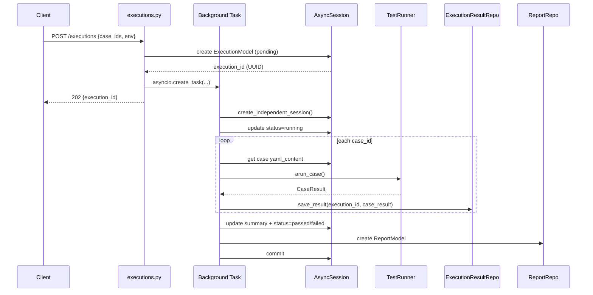

## 产品概述

将 AutoTest Framework 的 API 路由层从内存存储（InMemoryStore）完整迁移到 SQLAlchemy 数据库持久化（Repository 模式），实现测试用例、套件、执行结果和报告的真正持久化。执行触发后自动将 CaseResult 写入 execution_results 表并生成 report 记录到 reports 表。

## 核心功能

### 1. cases.py 数据库迁移

- 将 7 个接口（创建/列表/详情/更新/删除/版本历史/OpenAPI导入）全部从 InMemoryStore 切换到 CaseRepository
- ID 格式从 12 位 hex 字符串转为 UUID，API 响应中将 UUID 转为字符串保持兼容
- tags 字段在 list ↔ JSON 字符串之间序列化/反序列化
- 列表查询支持 tag/priority/search 过滤和模糊搜索（通过自定义 SQLAlchemy select 实现，因 BaseRepository.list() 仅支持 exact match）
- timeout 字段因 TestCaseModel 无此列，创建/更新时忽略

### 2. suites.py 数据库迁移

- 5 个 CRUD 接口全部切换到 SuiteRepository
- ID 统一转为 UUID
- TestSuiteModel 缺少 tags/case_ids 列，响应中不再返回这些字段

### 3. executions.py 核心改造

- POST /executions 触发执行时创建 ExecutionModel 写入 DB
- 后台异步任务使用独立 AsyncSession（不共享请求级 session），依次执行用例并将每个 CaseResult 通过 ExecutionResultRepository.save_result() 写入 execution_results 表
- 执行完成后根据结果生成 ReportModel（summary 字段存 JSON），写入 reports 表
- 异常路径同样持久化失败状态
- GET 列表/详情/报告接口从 DB 查询，summary 从 execution_results 实时计算

### 4. reports.py 报告列表切换

- GET /api/v1/reports 从 reports 表查询，JOIN executions 表获取 env/status 字段
- 用例统计（total_cases/passed/failed/pass_rate）从 ReportModel.summary JSON 反序列化
- trends 和 top-failures 接口不变（已使用 ReportService）

### 5. 清理与兼容

- 删除 routes 层对 InMemoryStore（get_store）的所有引用
- 保留 api/dependencies.py 中 InMemoryStore 类定义（标记为已废弃/测试保留）
- conftest.py 持久化钩子完全不受影响（独立使用引擎和 session）

## 技术栈

- **框架**: FastAPI + SQLAlchemy 2.0 异步
- **数据库**: PostgreSQL/SQLite（通过异步引擎自动适配）
- **ORM 模型**: framework.persistence.models（TestCaseModel、TestSuiteModel、ExecutionModel、ExecutionResultModel、ReportModel）
- **Repository**: framework.persistence.repositories（CaseRepository、SuiteRepository、ExecutionRepository、ExecutionResultRepository、ReportRepository）
- **Schema**: Pydantic v2（api.schemas）

## 实现方案

### 整体策略

将每个路由文件的 InMemoryStore `Depends(get_store)` 替换为 `Depends(get_db_session)` + 对应 Repository 实例。路由处理函数签名中的 `store: InMemoryStore` 参数替换为 `session: AsyncSession`，在处理函数内部创建 Repository 实例。

### 关键技术决策

#### 1. ID 格式转换层

所有路由参数 ID 从 `str` 转为 `uuid.UUID`（通过 `uuid.UUID(id_str)`），Repository 方法返回的 ORM 实例中 `.id` 属性为 `uuid.UUID`，在构建 Pydantic Response 时转为 `str(id)`。转换在路由层完成，不侵入 Repository。

#### 2. tags 序列化/反序列化

- **写入**: `json.dumps(tags_list)` → 存入 `TestCaseModel.tags`（Text 列）
- **读取**: `json.loads(tags_str)` → 反序列化为 `list[str]`
- 空列表/None 处理：`json.dumps(tags or [])`

#### 3. cases.py 搜索/过滤实现

BaseRepository.list() 仅支持 `column=value` exact match，无法满足 tag 包含、priority 过滤、name/description LIKE 搜索的组合需求。在路由层使用原生 `select()` + `or_` / `and_` 构建自定义查询：

```python
stmt = select(TestCaseModel)
if tag:
    stmt = stmt.where(TestCaseModel.tags.contains(f'"{tag}"'))
if priority:
    stmt = stmt.where(TestCaseModel.priority == priority)
if search:
    stmt = stmt.where(or_(
        TestCaseModel.name.ilike(f'%{search}%'),
        TestCaseModel.description.ilike(f'%{search}%')
    ))
```

#### 4. 后台任务独立 Session 管理

后台 `_execute_cases_in_background` 函数需要独立的 DB session。在 `api/dependencies.py` 中新增 `create_independent_session()` 函数，直接返回 `async_sessionmaker` 实例的上下文管理器，供后台任务使用。后台任务在 try/finally 中确保 session 正确 commit/rollback/close。

#### 5. 执行结果持久化流程

```
POST /executions
  → 创建 ExecutionModel(status=pending) → commit
  → asyncio.create_task(_execute_cases_in_background)
    → create_independent_session()
    → 更新 ExecutionModel.status=running, started_at=now
    → for each case_id:
        → CaseRepository.get(case_uuid) 获取 yaml_content
        → parse → runner.arun_case() → CaseResult
        → ExecutionResultRepository.save_result(execution_id, case_result, case_id)
    → 计算 summary {total, passed, failed, error, skipped}
    → 更新 ExecutionModel.status=passed/failed/error, finished_at=now
    → 创建 ReportModel(execution_id, summary=json(summary))
    → commit
```

#### 6. reports.py 列表聚合查询

使用 LEFT JOIN 将 ReportModel 与 ExecutionModel 关联，一次查询获取所有所需数据：

```python
stmt = select(ReportModel, ExecutionModel).join(
    ExecutionModel, ReportModel.execution_id == ExecutionModel.id
).order_by(ReportModel.created_at.desc()).offset(offset).limit(limit)
```

summary 字段为 JSON 字符串，在构建 ReportListItem 时反序列化获取 total_cases、passed、failed 等计数字段。

#### 7. CaseResult 到 ExecutionResultModel 的映射

CaseResult 是 dataclass，ExecutionResultModel 是 ORM model。映射关系：

- CaseResult.case_name → ExecutionResultModel.case_name
- CaseResult.passed → ExecutionResultModel.passed
- CaseResult.status.value → ExecutionResultModel.status
- CaseResult.error → ExecutionResultModel.error
- CaseResult.elapsed_ms → ExecutionResultModel.elapsed_ms

Request/Response 序列化已由 `execution_repo.save_result()` 内部的 `_serialize_dataclass` 处理。

### 架构设计



### 目录结构

```
api/
├── routers/
│   ├── cases.py          # [MODIFY] 全部切换到 CaseRepository + 自定义搜索查询
│   ├── suites.py         # [MODIFY] 全部切换到 SuiteRepository
│   ├── executions.py     # [MODIFY] 执行触发写 DB + 后台持久化 + 读 DB
│   └── reports.py        # [MODIFY] 列表接口切换 DB JOIN 查询
├── dependencies.py       # [MODIFY] 新增 create_independent_session()，标记 InMemoryStore 废弃
framework/persistence/
├── repositories/         # [UNCHANGED] ORM 模型和 Repository 签名不修改
│   ├── case_repo.py
│   ├── suite_repo.py
│   ├── execution_repo.py
│   └── report_repo.py
conftest.py               # [UNCHANGED] 持久化钩子不受影响
```

### 实现注意事项

**性能**：

- 报告列表查询使用单次 JOIN 替代 N+1，避免循环查询 executions 表
- 后台任务中 case 查询使用 CaseRepository.get()（主键查询，O(1)），不产生全表扫描
- tags JSON contains 查询在 SQLite 中用 LIKE、PostgreSQL 中用 JSONB 操作符，实际使用 SQLAlchemy `.contains()` 统一接口

**日志**：沿用项目 Logger（`framework.utils.logger`），后台任务完成后记录 `background_execution_completed` 事件，异常时记录 `background_execution_failed`。

**向后兼容**：

- API response 格式不变（所有 Schema 的 `id` 字段为 `str` 类型，UUID 转字符串后兼容）
- 路由路径和 HTTP 状态码不变
- InMemoryStore 类保留在 dependencies.py 中，标记 `# Deprecated: 测试保留，路由已切换至数据库` 注释
- conftest.py 的持久化钩子独立使用 `create_async_engine`，与路由层的 session factory 互不干扰

**Blast Radius**：只修改 api/routers/ 下 4 个文件和 api/dependencies.py，不改动 framework/ 下的任何文件。